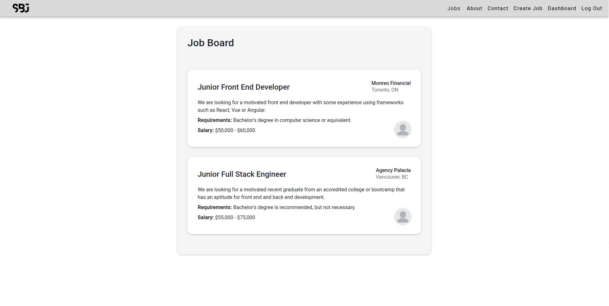
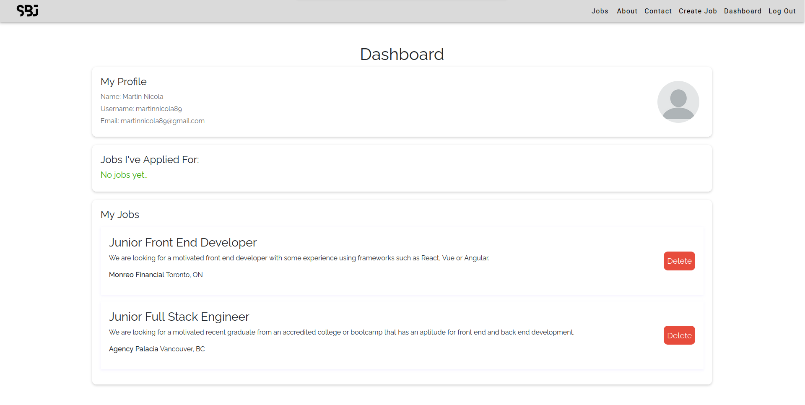
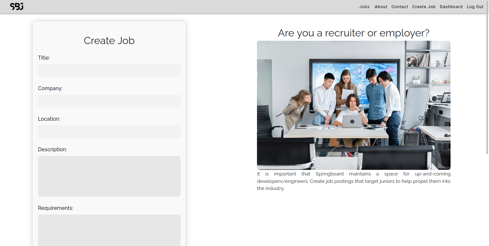

# **SpringBoardJuniors.io**

## General Overview

SpringBoardJuniors.io is a social media app designed for junior developers to springboard themselves into the tech industry. It is a LinkedIn for juniors.

Juniors that are fresh out of college or university can create an account and start applying to jobs that are truly for juniors. No more 5+ years experience for an entry level position. These positions are truly entry level.

Employers can login and create real job postings with an actual technical challenge. An example of a challenge would be:

"Create a full stack ecommerce application with CRUD functionality using Angular / Django as technologies for the frontend and backend".

Users will submit an application to each job which will include their portfolio link, deployment link (to technical) and github link (also to technical).

## Screenshots

## Technologies Used

- Django
- Angular
- PostgreSQL
- Bit.io
- Railway Deployment
- JWT
- CSS
- Bootstrap
- Vanilla JavaScript

## Complete Code

The code used in this repository is strictly for deployment and only contains the backend along with the Angular dist folder. For the full code, check out the following links:

- [Frontend](https://github.com/codewithmarty/springboardjuniors.io)
- [Backend](https://github.com/codewithmarty/springboardjuniors.io-api)

## Try it out

The app is available and ready to try [here](https://springboardio.up.railway.app/)

## Future Work

- **Redeploy application static files to S3, database to DynamoDB and backend on AWS Lamda**: Even though this is a splitting of concerns, ideally, all of the components of this application need to be redeployed on AWS to significantly reduce latency. With the database currently deployed on bit.io with the region being Iowa, the querying is taking significantly longer to load the data into the application. This impacts user experience. 